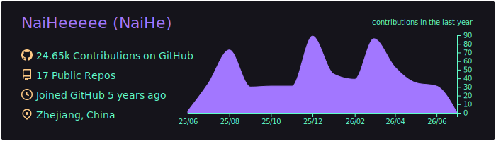
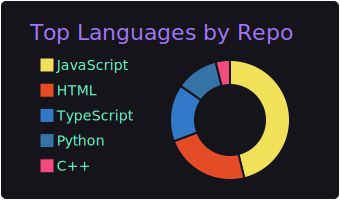
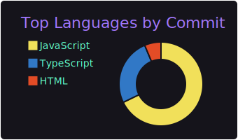
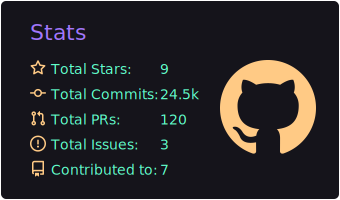
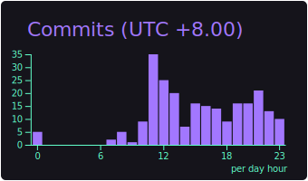

<div align="center">
  <!-- 访问统计 -->
  <table style="width:100%;">
    <tr>
      <td align="center">
        
      </td>
    </tr>
  </table>
</div>

<div align="center">
  <table style="width:100%;">
    <tr>
      <td align="center">
        <!-- 个人资料徽标 -->
        <a href="https://naihee.com/">
          </a>
        <a href="https://t.me/naihe666">
          </a>
        <a href="https://steamcommunity.com/id/naihe6/">
          </a>
        <a href="https://space.bilibili.com/232568569">
          </a>
        <a href="https://www.youtube.com/channel/UCLAriEYXiSDMX8HI6q21Keg">
          </a>
      </td>
    </tr>
  </table>
</div>

---

<div align="center">

<!-- year progress start -->
⏳ Year progress { ██████▁▁▁▁▁▁▁▁▁▁▁▁▁▁▁▁▁▁▁▁▁▁▁▁ } 21.52 %

⏰ Updated on Friday, March 20, 2026 at 21:07:43 GMT+8
<!-- year progress end -->

---

</div>

### ⭐ About My Github ⭐

<div align="center">
  <table style="width: 100%;">
    <tr>
      <td align="center" colspan="2">
        <a>
          
        </a>
      </td>
    </tr>
    <tr>
      <td align="center">
        <a>
          
        </a>
      </td>
      <td align="center">
        <a>
          
        </a>
      </td>
    </tr>
    <tr>
      <td align="center">
        <a>
          
        </a>
      </td>
      <td align="center">
        <a>
          
        </a>
      </td>
    </tr>
  </table>
</div>  

<div align="center">
  <table style="width: 100%;">
    <tr>
      <td align="center">
        
      </td>
    </tr>
  </table>
</div>

### ⭐ WakaTime ⭐

<div align="center" >
<!--START_SECTION:waka-->

```rust
From: 12 March 2026 - To: 19 March 2026

Total Time: 1 hr 52 mins

JavaScript   1 hr 47 mins          🟩🟩🟩🟩🟩🟩🟩🟩🟩🟩🟩🟩🟩🟩🟩🟩🟩🟩🟩🟩🟩🟩🟩🟩⬜   95.36 %
CSS          3 mins                🟩⬜⬜⬜⬜⬜⬜⬜⬜⬜⬜⬜⬜⬜⬜⬜⬜⬜⬜⬜⬜⬜⬜⬜⬜   03.04 %
Ruby         1 min                 🟨⬜⬜⬜⬜⬜⬜⬜⬜⬜⬜⬜⬜⬜⬜⬜⬜⬜⬜⬜⬜⬜⬜⬜⬜   01.57 %
HTML         0 secs                ⬜⬜⬜⬜⬜⬜⬜⬜⬜⬜⬜⬜⬜⬜⬜⬜⬜⬜⬜⬜⬜⬜⬜⬜⬜   00.03 %
```

<!--END_SECTION:waka-->
</div>

<div align="center" >
  <details>
    <summary>WakaTime Stats</summary>
    <table style="width: 100%;">
      <tr>
        <td align="center">
          
        </td>
      </tr>
      <tr>
        <td align="center">
          
        </td>
      </tr>
    </table>
  </details>
</div>

### ⭐ Pinned ⭐

<div align="center">
  <table style="width:100%;">
    <tr>
      <td align="center">
        <a href="https://github.com/NaiHeeeee/NaiHeeeee.github.io">
          
        </a>
      </td>
    </tr>
  </table>
</div>

### ⭐ About My Games ⭐

<div align="center">
  <table style="width: 100%;">
    <tr>
      <td align="center">
        
      </td>
    </tr>
    <tr>
      <td align="center">
         
      </td>
    </tr>
    <tr>
<td align="center">

<!-- steam-box start -->
🎮 Steam playtime leaderboard
<table>
  <tr>
    <td>💻 Wallpaper Engine</td>
    <td>🕘 24129 hrs 46 mins</td>
  </tr>
  <tr>
    <td>🍊 魔女的夜宴</td>
    <td>🕘 7431 hrs 23 mins</td>
  </tr>
  <tr>
    <td>🍊 Riddle Joker</td>
    <td>🕘 7408 hrs 47 mins</td>
  </tr>
  <tr>
    <td>🍊 Cafe Stella</td>
    <td>🕘 7408 hrs 16 mins</td>
  </tr>
  <tr>
    <td>🍊 Senren＊Banka</td>
    <td>🕘 7380 hrs 8 mins</td>
  </tr>
</table>
<!-- Powered by https://github.com/NaiHeeeee/steam-box . -->
<!-- steam-box end -->

</td>
</tr>
  </table>
</div>

### ⭐ Anime ⭐

<div align="center">
<table style="width: 100%;">
<tr>
<td align="center" colspan="2">

| 图片 | 番剧 | 图片 | 番剧 |
| --- | --- | --- | --- |
| [](https://lain.bgm.tv/pic/cover/l/99/17/292970_mxMxx.jpg) | 魔女之旅 | [](https://lain.bgm.tv/pic/cover/l/7c/8e/424883_5X5X2.jpg) | 不时轻声地以俄语遮羞的邻座艾莉同学 |


</td>
</tr>
</table>
</div>

### ⭐ Metrics ⭐

<div align="center">
  <details>
    <summary>metrics</summary>
    
  </details>
</div>